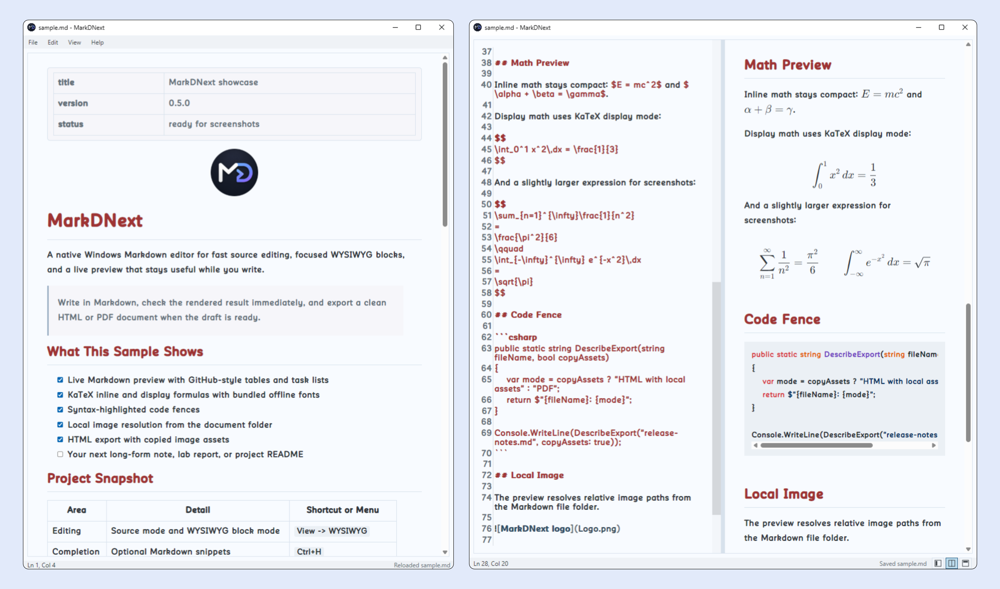

# MarkDNext

MarkDNext is a native Windows Markdown editor and viewer. It was vibe-coded with help from Codex, and is inspired by MDV, MarkText, and ghostwriter.



## Features

- WPF desktop app for Windows 10+ x64.
- No Electron runtime.
- Open Markdown files from the UI, drag and drop, or command line.
- Edit Markdown as source, preview, split view, or WYSIWYG block mode.
- In WYSIWYG mode, the editor itself is the preview: focused blocks expose raw Markdown, blurred blocks render automatically, and the same Markdown text stays synced with source mode.
- WYSIWYG mode includes block commands: type `/` in a focused block to insert headings, lists, code blocks, math blocks, and tables.
- Code blocks in WYSIWYG mode use a language field plus code body editor, with Markdown fences preserved in the saved source.
- Blurred WYSIWYG blocks can be reordered by dragging their hover handles, with a drop indicator showing the target position.
- Live WebView2 preview with off-screen KaTeX/code rendering before content is swapped into view.
- GitHub-style Markdown rendering through Markdig advanced extensions.
- Source editor highlighting, current-line highlighting, configurable line spacing, and completion through AvalonEdit.
- Automatic completion is optional from `Edit -> Automatic Completion`; `Ctrl+H` toggles it in source mode.
- Formatting shortcuts work in source and WYSIWYG editing: `Ctrl+B`, `Ctrl+I`, `Ctrl+U`, and `Ctrl+K`, plus selection wrapping with `$` or `` ` ``.
- View shortcuts: `Ctrl+W` WYSIWYG, `Ctrl+E` editor only, `Ctrl+R` preview only, and `Ctrl+T` split view. `Ctrl+Q` closes the window.
- Offline code highlighting through bundled highlight.js assets.
- KaTeX rendering for inline `$\alpha$` and display `$$\alpha$$` formulas.
- Auto reloads the file when it is changed on disk and the editor has no unsaved changes.
- Find in editor or preview; in split view, search follows the currently focused pane.
- Print from the File menu, or use `File -> Export` to export HTML or PDF. HTML export copies local images beside the document under an `assets` folder.
- Relative images and links resolve from the Markdown file folder.
- Theme chooser with built-in and imported themes, complete light/dark theme profile import/export, AppData persistence for user themes, and Mica/Acrylic window backdrop options when supported by Windows.

## Repository Layout

- `src/` contains the WPF application source and XAML views.
- `resources/app/` contains the app icon and window logo.
- `resources/web/` contains embedded offline WebView assets such as KaTeX and highlight.js.
- `resources/themes/` contains bundled color themes.
- `examples/` contains sample Markdown and theme profile files.
- `docs/` contains repository images and documentation media.
- `scripts/` contains local build and packaging helpers.

## Build

Install the .NET 8 SDK, then build from the repository root:

```powershell
dotnet build -c Release
```

## Publish

Release publishing is configured in `MarkDNext.csproj` as a self-contained, compressed single-file Windows x64 build.

```powershell
.\scripts\package-release.ps1
```

The release helper publishes the app and leaves a single standalone executable at:

```text
dist\MarkDNext-<version>-win-x64.exe
```

Direct `dotnet publish -c Release` still works for local testing, while the release helper cleans `dist` down to the versioned executable used for GitHub releases.

Run it from Explorer or from a terminal:

```powershell
.\dist\MarkDNext-<version>-win-x64.exe .\examples\sample.md
```

The preview requires Microsoft Edge WebView2 Runtime, which is already present on most current Windows 10/11 systems.

## License

MarkDNext is licensed under the Apache License, Version 2.0. See `LICENSE` and `NOTICE`.

This repository also includes third-party dependencies and bundled offline rendering assets. See `THIRD_PARTY_NOTICES.md` before redistributing source or binary builds.
